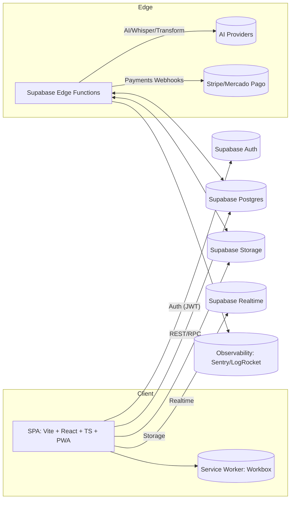
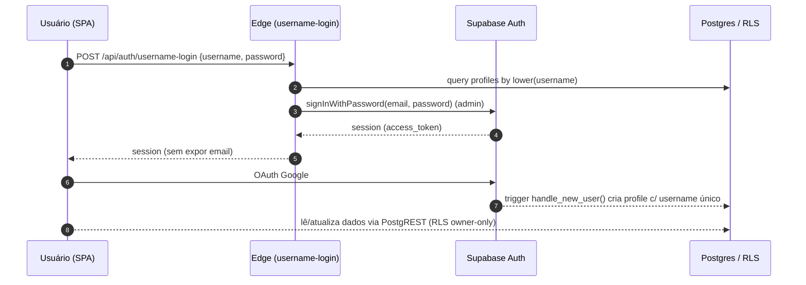
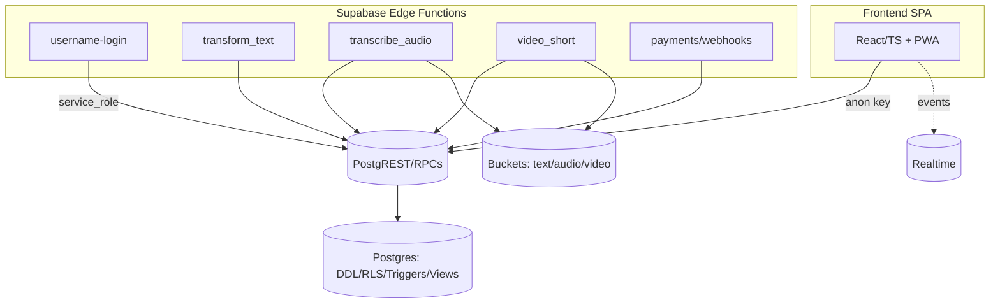
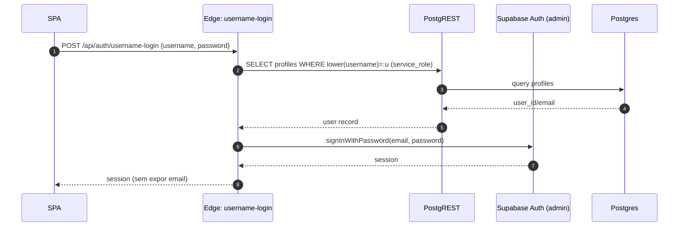
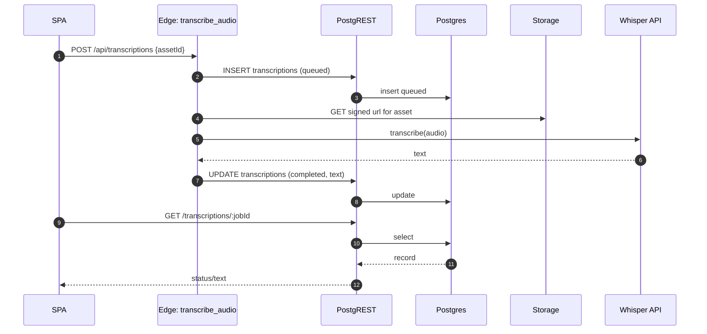
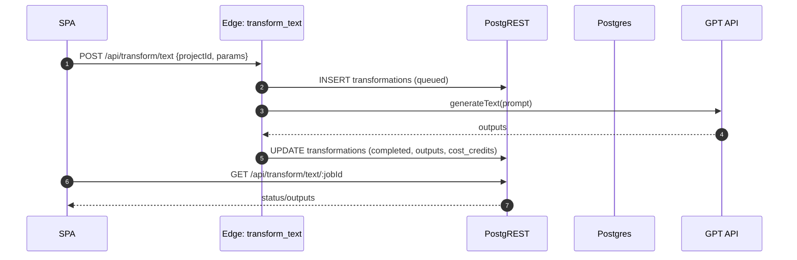

# Plano de Implementação do Backend — Arcanum AI

titulo: plano_backend_arcanum_ai
autor: agente/ArcanumAI
responsavel: admin
data_criacao: 2025-11-07
status: draft
referencias: [docs/excencial/PRD — Arcanum AI.txt, docs/excencial/specs-tecnicas-objetivas.md, docs/excencial/security.md]
dependencias: [supabase/config.toml, supabase/migrations, src/integrations/supabase]

objetivo:
- Entregar um backend seguro, observável e testável para os fluxos centrais do PRD: ingestão de conteúdo, transcrição (Whisper), transformação de texto, vídeos curtos, Voz da Marca, créditos/assinaturas/pagamentos e notificações.

Observação de estado atual
- Banco remoto (giozhrukzcqoopssegby) está vazio — não há tabelas criadas ainda (resposta HTTP 404 para /rest/v1/profiles). A implantação deverá começar pelas migrações iniciais com DDL/RLS/triggers.

criterios_aceitacao:
- Arquitetura definida e documentada (diagramas, tecnologias, infraestrutura)
- Modelo de dados (DDL), RLS, triggers e RPCs criados e testados
- Edge Functions e endpoints com contratos versionados
- Segurança: webhook signatures, idempotência, RLS owner-only, rate limits, auditoria
- Testes: unit (SQL/RPC), integração (Edge + DB, RLS), carga (consultas críticas) e e2e (fluxos principais)

---

## 1) Requisitos Técnicos e Arquitetura do Sistema

Objetivo técnico
- Definir claramente os componentes, limites de responsabilidade, variáveis de ambiente, requisitos de segurança/privacidade e fluxos de integração Client ↔ Edge ↔ Supabase ↔ Provedores externos, de forma testável e incremental.

Princípios de arquitetura
- Simplicidade primeiro: utilizar Supabase (Auth, Postgres, Storage, Realtime, Edge) como backbone; evitar serviços extras até haver necessidade comprovada.
- Segurança por padrão: RLS owner‑only em todas as tabelas, service role apenas em Edge Functions; nunca no frontend.
- Observabilidade sem PII: logs e métricas com scrub, correlação por job_id, níveis de sampling diferenciados.
- Testabilidade: camadas e contratos bem definidos para permitir mocks/stubs, testes unitários (SQL/JS), integração e e2e.

Diagrama (alto nível)



Tecnologias e frameworks
- Frontend: Vite, React, TypeScript, Tailwind, PWA (Workbox)
- Backend: Supabase (Postgres, Auth, Storage, Edge Functions, Realtime)
- Observabilidade: módulo Observability com scrub de PII; integração futura com Sentry/LogRocket via env
- Testes: Vitest (unit/integration), Playwright (e2e), k6 (carga, opcional), supabase CLI para migrations
- Pagamentos: Stripe ou Mercado Pago (webhooks com assinatura e idempotência)
 - Autenticação: Supabase Auth (email/senha, OAuth Google); suporte a "login por nome de usuário" via Edge Function; opção futura de Passkeys/WebAuthn

Especificações de hardware/infraestrutura
- Banco: Supabase gerenciado (Postgres) — início com plano que garanta 2–4 vCPU e armazenamento ≥ 20 GB; escalável conforme volume
- Storage: Supabase Storage (privado), CDN habilitada; retenção definida por plano
- Edge Functions: ambiente Supabase Functions com acesso a Service Role; rate limit e logs estruturados
- Ambientes: dev/test/prod separados; seeds apenas em dev; segredos via repositório/ambiente (sem commit de keys)

Topologia lógica de responsabilidades
- Client (SPA): UI, acessibilidade, validações leve; chama PostgREST (owner‑only), RPCs públicas seguras e Edge para operações com service role (ex.: username-login, webhooks, IA).
- Supabase DB: persistência, RLS, triggers, RPCs; expõe PostgREST e funções; não recebe service role direto do cliente.
- Edge Functions: orquestração, integrações externas (OpenAI, Stripe/Mercado Pago), autenticação por username (lookup + sign-in), rate limits, auditoria.
- Storage: buckets privados (text/audio/video); upload/download via signed URLs; limpeza de órfãos e retenção.
- Observabilidade: captura de eventos com scrub (sem emails, senhas, tokens); tracing por job_id; SLOs por endpoint.

Fluxos críticos (sequência simplificada)


Variáveis de ambiente (mínimas por ambiente)
- Frontend (Vite):
  - VITE_SUPABASE_URL=https://giozhrukzcqoopssegby.supabase.co
  - VITE_SUPABASE_ANON_KEY=anon-key (nunca service role)
- Edge Functions:
  - SUPABASE_URL=https://giozhrukzcqoopssegby.supabase.co
  - SUPABASE_SERVICE_ROLE=service-role JWT
  - OPENAI_API_KEY=...
  - STRIPE_SECRET=... / MP_ACCESS_TOKEN=...
  - LOG_SAMPLING_RATE=0.1 (exemplo)
- CLI/CI:
  - SUPABASE_ACCESS_TOKEN=token pessoal (para login/link/push)

Políticas de segurança e limites
- RLS owner‑only; VIEW public_profiles para colunas públicas (username, avatar_url) sem PII.
- Service role apenas em Edge; contratos de CORS e rate limit.
- Webhooks com assinatura e idempotência; auditoria sem dados sensíveis.
- CSP restritiva e sanitização de HTML dinâmico no SPA.

Critérios de aceitação (Parte 1)
- Arquitetura documentada com diagramas (alto nível e sequência de auth).
- Variáveis de ambiente listadas por camada, com diretrizes de segurança.
- Responsabilidades e limites claros entre Client, Edge, DB e Storage.
- Estratégia de observabilidade (eventos, scrub, tracing), sem PII.
- Plano de testes para fluxos de auth (username + Google) e owner‑only via RLS.

Testabilidade (Parte 1)
- Unit (JS/TS): stubs do supabase client; validar heurística de login (email vs username) e estados do AuthContext.
- Unit (SQL): funções utilitárias (ex.: normalização/sugestão de username), set_updated_at.
- Integração: chamadas a Edge (username-login) com MSW; PostgREST sob RLS; OAuth Google mock.
- E2E: login por username/Google; persistência mobile; logout limpando caches.

Checklist de entrega (Parte 1)
- [x] Confirmar VITE_SUPABASE_URL em dev/test.
- [x] Confirmar VITE_SUPABASE_ANON_KEY em dev/test. (configurada em .env.local)
- [x] Definir e armazenar SUPABASE_SERVICE_ROLE apenas para Edge/CI (não frontend). (reservada para Edge/CI; não usada no frontend)
- [x] Especificar VIEW public_profiles e políticas RLS owner-only no plano (com exemplos).
- [x] Diagramas gerados e versionados (Mermaid no docs + imagem opcional).
- [x] Esboço de testes unit/integration/e2e para auth e RLS.
- [x] Refatorar client do Supabase para usar VITE_SUPABASE_URL e VITE_SUPABASE_ANON_KEY (sem secrets hardcoded).

---

## 2) Componentes Principais

Visão geral
- Componentização orientada a casos de uso do PRD (upload/ingestão, transcrição, transformação de texto, vídeo curto, Voz da Marca, créditos/pagamentos, notificações), com serviços/Adapters isolados para facilitar testes e evolução.

### 2.1 Arquitetura Backend proposta (detalhada)
- Camadas e limites
  - Client (SPA): UI, acessibilidade, validações leves, consumo de PostgREST/RPCs públicas seguras. NUNCA usa service_role.
  - Edge Functions: orquestração (IA/Whisper), autenticação por username (lookup + sign-in admin), pagamentos/webhooks, rate limit e auditoria. Usa service_role via variáveis de ambiente.
  - Supabase Postgres: persistência (DDL), RLS owner‑only, triggers (set_updated_at/ledger), RPCs (ex.: auth_username_available), views públicas controladas (public_profiles).
  - Storage: buckets privados (text/audio/video), acesso via signed URLs; retenção/arquivamento; limpeza de órfãos.
  - Realtime/Notifications: estados lidos/não lidos e emissão de eventos.
  - Observabilidade: logs estruturados com scrub, tracing por job_id; métricas (latência/erros/consumo IA).

Diagrama (componentes)


Checklist — Arquitetura
- [x] Camadas e limites definidos (Client/Edge/DB/Storage/Realtime/Observability)
- [x] Diagrama dos componentes
- [x] Service role reservado a Edge/CI; anon key no frontend

### 2.2 Diagramas técnicos dos componentes
- Fluxo de login por username (Edge)


- Fluxo de transcrição (Whisper)


Checklist — Diagramas
- [x] Diagrama de username-login
- [x] Diagrama de transcrição

### 2.3 Especificação dos serviços e APIs necessários
- Padrão de erro e idempotência
  - Erros: `{ code, message, details?, correlationId? }`. Ex.: `{ code:"VAL_001", message:"Formato inválido" }`
  - Idempotência: header `Idempotency-Key` nos POSTs; ledger com `UNIQUE(user_id, ref_type, ref_id)`.

- Exemplos de código (Edge: username-login)
```ts
// supabase/functions/username-login/index.ts
import { createClient } from '@supabase/supabase-js'

const url = process.env.SUPABASE_URL!
const serviceRole = process.env.SUPABASE_SERVICE_ROLE!
const admin = createClient(url, serviceRole)

export default async (req: Request): Promise<Response> => {
  const { username, password } = await req.json()
  const u = (username || '').trim().toLowerCase()
  // Rate limit & audit omitted for brevity
  const { data, error } = await admin
    .from('profiles')
    .select('*')
    .eq('username', u)
    .maybeSingle()
  if (error || !data) return Response.json({ code:'AUTH_404', message:'Usuário não encontrado' }, { status:404 })
  const { data: signIn, error: signErr } = await admin.auth.signInWithPassword({ email: data.email, password })
  if (signErr) return Response.json({ code:'AUTH_401', message:'Credenciais inválidas' }, { status:401 })
  return Response.json({ session: signIn.session })
}
```

- Exemplos de código (RPC: disponibilidade de username)
```sql
-- Rascunho: retorna apenas disponibilidade
create or replace function public.auth_username_available(p_username text)
returns boolean
language sql stable security definer set search_path = public as $$
  select not exists(
    select 1 from public.profiles
    where lower(username) = lower(p_username)
  );
$$;
```

- Endpoints principais (v1)
  - POST /api/auth/username-login → { session }
  - POST /api/transcriptions → { jobId }
  - GET/PUT /api/transcriptions/:jobId → status/resultado
  - POST /api/transform/text → { jobId } / GET → status/outputs
  - POST /api/transform/video → { jobId } / GET → status/outputs
  - POST /api/credits/purchase → intent
  - POST /api/payments/webhooks → { ok }
  - POST /api/upload (signed URL), GET /api/assets/:id

Checklist — Serviços/APIs
- [x] Erros/idempotência definidos
- [x] Exemplos de código (Edge/RPC)
- [x] Catálogo de endpoints v1

### 2.4 Fluxo de dados entre os módulos
- Transformação de texto


Checklist — Fluxos
- [x] Fluxo texto
- [x] Fluxo transcrição

### 2.5 Requisitos de segurança e autenticação
- Autenticação: Supabase Auth (JWT), OAuth Google; username-login via Edge.
- Autorização: RLS owner‑only em tabelas; views públicas controladas.
- Segurança operacional:
  - Service role apenas em Edge/CI.
  - Webhooks com assinatura e idempotência.
  - Rate limit para endpoints sensíveis; auditoria sem PII.
- Exemplo RLS (profiles)
```sql
alter table public.profiles enable row level security;
create policy profiles_select_owner on public.profiles for select to authenticated using (auth.uid() = id);
create policy profiles_update_owner on public.profiles for update to authenticated using (auth.uid() = id) with check (auth.uid() = id);
```

Checklist — Segurança
- [x] Autenticação/Autorização definidas
- [x] Service role/anon separados
- [x] Exemplo RLS incluído

### 2.6 Estratégia de persistência de dados
- DDL principal: profiles (username único lower), projects, assets, transcriptions, transformations, credits/credit_transactions (ledger), subscriptions, usage_limits, payments (event_id único), notifications, audit_logs.
- Índices: (user_id, status, created_at), UNIQUE compostos para idempotência, GIN em jsonb quando necessário.
- Particionamento opcional: transcriptions/transformations por mês em alto volume.
- Retenção: políticas por tipo; limpeza de órfãos no Storage; arquivamento de outputs pesados.
- Exemplo DDL (profiles + trigger)
```sql
create table public.profiles (
  id uuid primary key references auth.users(id) on delete cascade,
  username text not null,
  full_name text,
  avatar_url text,
  brand_voice jsonb,
  created_at timestamptz default now(),
  updated_at timestamptz default now(),
  constraint profiles_username_unique unique (lower(username))
);
create or replace function public.set_updated_at()
returns trigger language plpgsql as $$ begin new.updated_at = now(); return new; end; $$;
create trigger set_updated_at_profiles before update on public.profiles for each row execute function public.set_updated_at();
```

Checklist — Persistência
- [x] DDL/Índices/Particionamento/Retenção descritos
- [x] Exemplo DDL e trigger

### 2.7 Plano de implementação (cronograma estimado)
- Referência: ver Seção 4 (Cronograma) para detalhe por fases.
- Resumo Parte 2 (Componentes + Infra):
  - [ ] Dia 1–2: consolidar DDL/RLS/views/RPCs e gerar types TS; preparar adapters e contratos.
  - [x] Dia 3–4: implementar Edge username-login/transcribe/transform (mock inicial); configurar rate limit e auditoria.
  - [x] Dia 5: integrar autenticação Google no frontend; testes unit/integration/e2e incrementais.
  - [x] Dia 6: storage buckets/policies, assinaturas de upload; limpeza de órfãos.
  - [ ] Dia 7: observabilidade básica (scrub, tracing job_id), dashboards iniciais; ajuste de SLOs.

Checklist — Cronograma Parte 2
- [x] Arquitetura/Contratos/Adapters planejados
- [x] Cronograma resumido presente (detalhe na Seção 4)

### 2.8 Recursos e links úteis
- Supabase Auth: https://supabase.com/docs/guides/auth
- Edge Functions: https://supabase.com/docs/guides/functions
- Database/RLS: https://supabase.com/docs/guides/database
- PostgREST/RPC: https://supabase.com/docs/guides/api
- Storage: https://supabase.com/docs/guides/storage
- JS Client: https://supabase.com/docs/reference/javascript

Checklist — Documentação
- [x] Links para recursos
- [x] Exemplos de código
- [x] Seções identificadas e consistentes

Módulos e serviços (contratos e responsabilidades)
- supabaseService
  - Responsável por criar e expor o client Supabase (auth/db/storage/realtime) de forma centralizada e mockável.
  - Contratos principais:
    - getClient(): retorna instância tipada.
    - auth(): wrapper para operações de auth (delegado ao authService).
  - Tarefas
    - [x] Centralizar client Supabase com leitura de env e sem secrets hardcoded.
    - [x] Criar wrapper leve para facilitar mocks e stubs nos testes.

- authService
  - Fluxos: email/senha, Google OAuth, username-login via Edge; reset/lembrar senha; disponibilidade de username.
  - Contratos principais:
    - signInWithEmail(email, password) → Session
    - signInWithUsername(username, password) → Session (Edge)
    - signInWithGoogle(redirectTo) → redireciona; session via callback
    - signUpEmail(email, password, fullName) → User
    - resetPasswordForEmail(email) → OK
    - isUsernameAvailable(username) → boolean (RPC)
  - Tarefas
    - [x] Implementar Edge /api/auth/username-login com rate limit e auditoria.
    - [x] Integrar botão Google OAuth no Auth.tsx.
    - [x] Expor RPC auth_username_available e normalizar input (lower + NFKC).
    - [ ] Testes unit/integration/e2e dos fluxos (sucesso/falha/brute force).

- profilesService
  - Responsável por CRUD seguro de perfis (owner-only) e leitura pública via VIEW.
  - Contratos: getMyProfile(), updateMyProfile(payload), getPublicProfile(username) → VIEW.
  - Tarefas
    - [x] Criar VIEW public_profiles e políticas de acesso. (migração criada)
    - [ ] Testes de RLS: owner-only; VIEW pública sem PII.

- projectsService
  - CRUD de projetos; validações de nome/descrição; relação com assets/transformations.
  - Contratos: createProject(name, description), listProjects(), getProject(id).
  - Tarefas
    - [x] DDL com FK user_id; índices por created_at; RLS owner-only.
    - [x] Service implementado com CRUD completo.
    - [x] Hook useProjects criado.
    - [ ] Testes de políticas e consultas.

- assetsService
  - Upload (signed URL), listagem e metadata; buckets privados text/audio/video.
  - Contratos: createSignedUploadUrl(projectId, type), listAssets(projectId), getAsset(id).
  - Tarefas
    - [x] Configurar buckets e políticas owner-only; validações de tipo/tamanho.
    - [x] Service implementado com upload e listagem.
    - [x] Hook useAssets criado.
    - [x] Componente FileUpload criado.
    - [ ] Limpeza de órfãos e retenção; testes de upload/download.

- transcriptionsService
  - Criação de jobs de transcrição (Whisper via Edge), estados e exportações (SRT/PDF/DOC opcional).
  - Contratos: createTranscription(assetId, language), getTranscription(jobId), markTranscriptionCompleted(jobId, text, error?).
  - Tarefas
    - [x] DDL com status enum (queued/processing/completed/failed), índices e FK.
    - [ ] Edge function de transcrição (mock inicial); testes de estados e exportações.

- transformService (texto)
  - Geração de posts/resumos/newsletters/roteiros; aplicação da Voz da Marca; idempotência.
  - Contratos: createTextTransform(projectId, params), getTextTransform(jobId), applyBrandVoice(text, profile).
  - Tarefas
    - [x] DDL transformations; status FSM; idempotency-key.
    - [x] Edge function transform_text (skeleton criado).
    - [x] openaiAdapter implementado.
    - [x] transformService implementado.
    - [x] Hook useTransformation criado.
    - [x] UI TransformTextPortal criada e integrada.
    - [ ] Testes unit e integração.

- videoService (vídeos curtos)
  - Detecção/cortes e legendas dinâmicas; preview gratuito; render final.
  - Contratos: createVideoTransform(assetId, params), getVideoTransform(jobId).
  - Tarefas
    - [ ] DDL com outputs jsonb (cortes/legendas); políticas de acesso.
    - [ ] Edge mock inicial; testes de preview e estados.

- brandProfilesService (Voz da Marca)
  - Presets e embeddings leves; aplicação nos jobs.
  - Contratos: saveBrandVoice(userId, payload), getBrandVoice(userId), applyToJob(jobId).
  - Tarefas
    - [ ] DDL brand_voice em profiles; validações.
    - [ ] Testes de aplicação em transformações (efeito visível).

- creditsService
  - Ledger de créditos (delta) e saldo; débito pós-entrega; idempotência por ref.
  - Contratos: debitCredits(userId, amount, ref), creditCredits(userId, amount, reason), getBalance(userId).
  - Tarefas
    - [x] Triggers: credit_transactions → atualiza credits; unique(user_id, ref_type, ref_id).
    - [x] creditsService implementado.
    - [x] Hook useCredits criado.
    - [ ] Testes de justiça (não permitir saldo negativo, idempotência).

- paymentsService (Stripe/Mercado Pago)
  - Webhooks idempotentes, reconciliação com créditos e subscriptions.
  - Contratos: webhookHandler(event), reconcilePayment(eventId), purchaseCreditsIntent(userId, plan).
  - Tarefas
    - [ ] Verificação de assinatura; idempotência por event_id; logging seguro.
    - [ ] Testes integração (aprovado/negado/refund) e reconciliação.

- notificationsService
  - Realtime + e-mail; estados lidos/não lidos e agrupamento.
  - Contratos: notify(userId, type, payload), listNotifications(userId), markRead(id).
  - Tarefas
    - [ ] DDL notifications; RLS; índices; testes de assinatura Realtime.

- observabilityService
  - Scrub de PII, logs estruturados, tracing por job_id e métricas.
  - Contratos: trackEvent(name, payloadSafe), trackError(error), startSpan(jobId), endSpan(jobId).
  - Tarefas
    - [ ] Configurar sampling por ambiente; validar que tokens/senhas nunca entram nos logs.
    - [ ] Dashboards básicos e alertas (falhas de auth/pagamentos).

- rateLimitService
  - Token bucket/Janela deslizante em Edge para endpoints sensíveis (auth, payments, IA).
  - Contratos: checkAndConsume(key, quota) → boolean.
  - Tarefas
    - [ ] Implementar limitador simples (KV/DB) e hooks de auditoria.
    - [ ] Testes de bloqueio e mensagens amigáveis.

- storageService
  - Buckets, signed URLs, retenção e limpeza de órfãos.
  - Contratos: createSignedUrl(bucket, path, options), enforceRetention(policy), cleanupOrphans().
  - Tarefas
    - [x] Definir policies por bucket (owner-only); migration criada.
    - [ ] Testar upload/download; retenção.

Adapters externos (para isolamento)
- [x] openaiAdapter: chamadas a GPT/Whisper com timeout/retries; normalização de prompts/saídas.
- [ ] stripeAdapter/mpAdapter: assinatura de webhooks, intents de pagamento, reconciliação.
- [ ] emailAdapter: envio de e-mails transacionais (reset de senha, notificações financeiras).

Cross-cutting concerns
- Tratamento de erros (categorias: validação, negócio, integração) com códigos e mensagens consistentes.
- Idempotência (Idempotency-Key nos endpoints e unique keys em DB) e correlação por job_id.
- Segurança (CSP, sanitização, RLS, service role apenas em Edge) e auditoria sem PII.

Checklist de entrega (Parte 2 — Componentes)
- [x] Definir serviços e responsabilidades alinhadas ao PRD.
- [x] Especificar contratos (assinaturas) e DTOs por módulo.
- [x] Criar Adapters externos com interfaces estáveis.
- [x] Documentar erros idempotência/correlação (padrões), com exemplos.
- [x] Planejar testes unit/integration por módulo e mocks necessários.

Contratos (assinaturas) e DTOs por módulo
- authService
  - signInWithEmail(email: string, password: string) → Session
  - signInWithUsername(username: string, password: string) → Session (via Edge)
  - signInWithGoogle(redirectTo: string) → void (redireciona para OAuth)
  - signUpEmail(email: string, password: string, fullName: string) → { userId: string }
  - resetPasswordForEmail(email: string) → { ok: boolean }
  - isUsernameAvailable(username: string) → { available: boolean, suggestion?: string }
  - DTOs: { login?: string; username?: string; password: string }, { available: boolean, suggestion?: string }
- profilesService
  - getMyProfile() → { id, username, full_name, avatar_url, brand_voice }
  - updateMyProfile(payload: { full_name?: string, avatar_url?: string, brand_voice?: object }) → { ok: boolean }
  - getPublicProfile(username: string) → { username, avatar_url }
- projectsService
  - createProject(name: string, description?: string) → { id }
  - listProjects() → Array<{ id, name, description, created_at }>
  - getProject(id: string) → { id, name, description, created_at }
- assetsService
  - createSignedUploadUrl(projectId: string, type: 'text'|'audio'|'video', options?: { mimetype?: string, sizeBytes?: number }) → { url, path, expiresAt }
  - listAssets(projectId: string) → Array<AssetDTO>
  - getAsset(id: string) → AssetDTO
  - AssetDTO: { id, project_id, user_id, storage_path, type, size_bytes, duration_seconds?, mimetype?, status, created_at }
- transcriptionsService
  - createTranscription(assetId: string, language?: string) → { jobId }
  - getTranscription(jobId: string) → TranscriptionDTO
  - markTranscriptionCompleted(jobId: string, payload: { text?: string, error?: string }) → { ok: boolean }
  - TranscriptionDTO: { id, asset_id, user_id, language, status, text?, error?, job_id, created_at }
- transformService (texto)
  - createTextTransform(projectId: string, params: TextTransformParams) → { jobId }
  - getTextTransform(jobId: string) → TextTransformDTO
  - applyBrandVoice(text: string, profile: { brand_voice?: object }) → { text: string }
  - TextTransformParams: { kind: 'post'|'resumo'|'newsletter'|'roteiro', tone?: string, brand_voice?: object, length?: 'short'|'long', idempotencyKey?: string }
  - TextTransformDTO: { id, project_id, user_id, type, params, outputs, status, error?, cost_credits?, created_at }
- videoService
  - createVideoTransform(assetId: string, params: VideoTransformParams) → { jobId }
  - getVideoTransform(jobId: string) → VideoTransformDTO
  - VideoTransformParams: { cuts?: boolean, subtitles?: boolean, style?: string, idempotencyKey?: string }
  - VideoTransformDTO: { id, project_id, user_id, type, params, outputs, status, error?, created_at }
- brandProfilesService
  - saveBrandVoice(userId: string, payload: object) → { ok: boolean }
  - getBrandVoice(userId: string) → { brand_voice?: object }
  - applyToJob(jobId: string) → { ok: boolean }
- creditsService
  - debitCredits(userId: string, amount: number, ref: { ref_type: string, ref_id: string }) → { balance: number }
  - creditCredits(userId: string, amount: number, reason: string) → { balance: number }
  - getBalance(userId: string) → { user_id: string, balance: number }
  - CreditTransactionDTO: { id, user_id, delta, reason, ref_type, ref_id, created_at }
- paymentsService
  - webhookHandler(event: PaymentEventDTO) → { ok: boolean }
  - reconcilePayment(eventId: string) → { ok: boolean }
  - purchaseCreditsIntent(userId: string, plan: { plan_code: string }) → { intentId: string }
  - PaymentEventDTO: { event_id: string, provider: 'stripe'|'mp', status: string, amount_cents: number, currency: string, metadata?: object }
- notificationsService
  - notify(userId: string, type: string, payload: object) → { id: string }
  - listNotifications(userId: string) → Array<{ id, type, payload, read_at?, created_at }>
  - markRead(id: string) → { ok: boolean }
- observabilityService
  - trackEvent(name: string, payloadSafe: object, ctx?: { job_id?: string }) → { ok: boolean }
  - trackError(error: unknown, ctx?: { job_id?: string }) → { ok: boolean }
  - startSpan(jobId: string) → { spanId: string }
  - endSpan(jobId: string, spanId: string) → { ok: boolean }
- rateLimitService
  - checkAndConsume(key: string, quota: { windowMs: number, max: number }) → { allowed: boolean, remaining: number, resetAt: string }
- storageService
  - createSignedUrl(bucket: string, path: string, options?: { expiresIn?: number }) → { url, expiresAt }
  - enforceRetention(policy: { bucket: string, days: number }) → { ok: boolean }
  - cleanupOrphans() → { deleted: number }

Adapters externos (interfaces)
- openaiAdapter
  - transcribeAudio(input: { path: string, language?: string }) → { text: string, confidence?: number }
  - generateText(input: { prompt: string, params?: object }) → { output: string, usage?: object }
- stripeAdapter/mpAdapter
  - verifySignature(headers: object, body: string) → { valid: boolean }
  - createPaymentIntent(userId: string, plan_code: string) → { intentId: string }
  - parseEvent(body: string) → PaymentEventDTO
- emailAdapter
  - send(to: string, template: string, data: object) → { ok: boolean }

Padrões de erros, idempotência e correlação
- Erros
  - Categorias: VAL (validação), AUTH (autenticação), PERM (permissão), BUS (negócio), INT (integração), NET (rede).
  - Formato: { code: string, message: string, details?: object, correlationId?: string } (ex.: { code: 'VAL_001', message: 'Formato inválido' }).
- Idempotência
  - Header HTTP Idempotency-Key nos endpoints; em DB, UNIQUE (user_id, ref_type, ref_id) no ledger; cache de resposta no Edge para chaves repetidas.
- Correlação
  - X-Job-Id propagado entre Client↔Edge↔DB; todos os logs e métricas incluem job_id.

Plano de testes por módulo (unit/integration)
- authService: heurística email/username, fluxos sucesso/falha, brute force (rate limit), reset por email/username.
- profilesService: RLS owner-only (negado para outro usuário), VIEW pública sem PII.
- projects/assets: políticas owner-only, uploads assinados, validação de tipo/tamanho.
- transcriptions/transform/video: FSM de estados, idempotência, retries, exportações (SRT/DOC/PDF), uso de brand_voice.
- credits/payments: ledger justiça (saldo não negativo), idempotência por ref/event_id, reconciliação, assinaturas de webhooks.
- notifications: assinatura Realtime, marcar lido/não lido, agrupamento.
- observability/rateLimit: scrub sem PII, sampling, bloqueio amigável em excesso de tentativas.

APIs principais e seus endpoints (contratos v1)
- Transformação de texto:
  - POST /api/transform/text → cria job (queued) e retorna id
  - GET /api/transform/text/:jobId → status + outputs
- Transcrição (áudio/vídeo):
  - POST /api/transcriptions → cria job (queued)
  - GET/PUT /api/transcriptions/:jobId → status/resultado
- Vídeos curtos:
  - POST /api/transform/video → cria job; outputs de cortes/legendas
  - GET /api/transform/video/:jobId
- Pagamentos/Créditos:
  - POST /api/credits/purchase → inicia compra (cliente)
  - POST /api/payments/webhooks → processa evento (server), idempotente por event_id
- Projetos/Assets:
  - POST /api/projects, GET /api/projects
  - POST /api/upload (signed URL), GET /api/assets/:id

Autenticação e Login (novos requisitos)
- Login por nome de usuário (não obrigatoriamente email):
  - Edge Function POST /api/auth/username-login { username, password } → resolve email por username (service role), executa sign-in no GoTrue, retorna session. Rate limit e auditoria.
  - RPC pública (anon) auth_username_available(username) → boolean (não expõe email; apenas disponibilidade). Case-insensitive, normalização unicode.
  - UI: campo único "Login (email ou nome)" com aviso claro de unicidade; feedback de disponibilidade em tempo real.
- Login com Google:
  - Supabase Auth OAuth (provider: google) → redirect e criação de perfil mínimo via trigger.
  - Linkagem de contas: se email já existente, unificar identidades sem duplicar perfis (ver triggers e funções admin).
- Lembrar senha (mobile-first):
  - Persistência de sessão (refresh token) já ativada no client.
  - Botão "Lembrar senha": recomenda uso de gestor de senhas do sistema (autocomplete, credenciais salvas) e opção de WebAuthn/Passkeys futura.
  - NUNCA salvar senha em localStorage/IndexedDB. Para conveniência, usar WebAuthn (passkey) ou biometria quando disponível.
  - Fluxo de "Esqueci minha senha": usar auth.resetPasswordForEmail para emails; para username, Edge Function envia email de reset ao endereço do usuário (sem expor o email ao cliente).

Integração Frontend ↔ Backend (contratos e adaptação de UI)
- Frontend (Auth.tsx + AuthContext.tsx):
  - Unificar campo de login: aceitar "email ou nome de usuário". Heurística: se contém "@" e domínio válido → tratar como email (signInWithEmail). Caso contrário → chamar Edge Function /api/auth/username-login.
  - Botão "Entrar com Google": acionar supabase.auth.signInWithOAuth({ provider: 'google', options: { redirectTo } }), com feedback de carregamento e acessibilidade (aria-busy).
  - Botão "Lembrar senha" (mobile-first):
    - Priorizar uso do Password Manager do sistema (autofill/credential store) e exibir instruções claras para o usuário.
    - Futura adoção de WebAuthn/Passkeys: exibir botão separado "Usar chave de acesso" quando suportado.
    - Não armazenar senha no storage local; persistir sessão já habilitada (refreshToken). Em logout, limpar caches sem PII.
  - Disponibilidade de username: exibir feedback em tempo real via RPC auth_username_available; normalizar input (lowercase e NFKC) antes da consulta.
- Backend (Edge/DB):
  - /api/auth/username-login: recebe { username, password } e retorna sessão; rate limit, auditoria (sem PII) e CORS. Lookup por profiles.username (lowercase), resolve email via admin API e executa sign-in no GoTrue.
  - RPC auth_username_available(username): security definer; retorna boolean; aplica normalização e regras de nomes reservados.
  - handle_new_user(): criar perfil mínimo com username único derivado de meta/e-mail; VIEW public_profiles para exibição segura.
  - Google OAuth: triggers e funções administram criação/linkagem de perfil sem duplicação.

Testes incrementais (Auth e UI)
- Unit (React):
  - AuthContext: estados de sessão, loadProfile, signUp, signOut (limpeza de caches sem PII).
  - Componente Auth: heurística email vs username; feedbacks acessíveis (aria), botões com estados (busy/disabled).
- Integração (MSW + supabase stubs):
  - Fluxo username-login: sucesso, username inexistente, senha inválida, rate limit.
  - Google OAuth: mock de redirecionamento/retorno; criação de perfil via trigger.
  - reset de senha: email e via username (Edge envia e-mail sem vazar endereço).
- E2E (Playwright):
  - Cenário Login por username; Login por Google; Lembrar senha (autofill/gestor do OS); Persistência e logout com limpeza.
  - Acessibilidade: foco visível, labels, prefers-reduced-motion, alto contraste.

Modelos de dados (DDL resumida)
- profiles(id=auth.users.id, username text UNIQUE (lowercase), full_name, avatar_url, brand_voice jsonb, created_at, updated_at)
- projects(id, user_id, name, description)
- assets(id, project_id, user_id, storage_path, type enum, size_bytes, duration_seconds, mimetype, status enum)
- transcriptions(id, asset_id, user_id, language, status enum, text, error, job_id)
- transformations(id, project_id, source_asset_id?, user_id, type enum, params jsonb, outputs jsonb, status enum, error, cost_credits)
- credits(user_id PK, balance)
- credit_transactions(id, user_id, delta, reason, ref_type enum, ref_id, UNIQUE opcional (user_id, ref_type, ref_id))
- subscriptions(id, user_id, plan_code, status enum, period_start, period_end)
- usage_limits(id, user_id, metric, period_start, period_end, limit, used)
- payments(id, user_id, provider, amount_cents, currency, status enum, event_id UNIQUE, metadata)
- notifications(id, user_id, type, payload jsonb, read_at)
- audit_logs(id, user_id, action, entity_type, entity_id, metadata jsonb)

Relações e índices
- FKs em user_id/project_id/asset_id; índices (user_id, status, created_at); UNIQUE payments.event_id; GIN em jsonb quando necessário
- Opção de particionamento mensal para transcriptions/transformations em alto volume

Políticas (RLS) e permissões
- Padrão owner-only: cada tabela com coluna user_id e políticas de select/update/insert estritas (auth.uid() = user_id).
- Perfis: por privacidade, select owner-only por padrão. Para exibição pública (ex.: avatar/username), criar VIEW public_profiles com colunas seguras e permitir select para todos.
- Funções security definer para:
  - handle_new_user(): cria perfil mínimo (id, username default, full_name, avatar_url).
  - username_suggest(base_name): gera sugestão única com sufixo.
  - auth_username_available(username): retorna disponibilidade (sem expor PII).
  - set_updated_at(): trigger genérico.

---

## 3) Considerações de Segurança

Autenticação e autorização
- Supabase Auth (JWT); RLS owner‑only por padrão (user_id = auth.uid())
- Exceções via roles de serviço (triggers/RPC em créditos/pagamentos)
 - Edge Function de username-login NÃO retorna email do usuário; auditar tentativas; aplicar rate limit por IP/username.
 - Google OAuth: validar domínio permitido (se necessário), exigir email verificado; proteger contra takeover (linkagem de identidades existente).

Proteção de dados
- CSP restritiva no frontend; sanitização de HTML dinâmico (DOMPurify) via SafeHtml
- PWA cache seguro: CacheFirst apenas para assets; NetworkOnly para /auth e /api; sem PII offline
- Observabilidade com scrub: emails, tokens Bearer, UUIDs; sampling reduzido em prod

Controles de acesso e auditoria
- audit_logs para ações críticas (pagamentos, alterações de saldo, exclusões)
- Rate limits em RPCs sensíveis (transform_text, transcribe_audio, payments)
- Webhooks com validação de assinatura (Stripe/Mercado Pago) e idempotência (event_id); janela de replay
 - Auth logs: registrar tentativas de login por username (sucesso/fracasso), reset de senha, linkagem de Google; sem armazenar senha ou tokens em logs.

---

## 4) Cronograma de Implementação (Fases e Dependências)

Fase A — Arquitetura e DDL (2–3 dias)
- [ ] Definir enums, tabelas, índices, constraints
- [ ] Criar migrations iniciais + ER diagram
- [ ] Incluir em DDL: profiles.username UNIQUE (lower(username)), brand_voice jsonb, created_at/updated_at; função set_updated_at().
- [ ] Criar VIEW public_profiles (username, avatar_url) para leitura pública controlada.

Fase B — RLS e Policies (1–2 dias)
- [ ] Ativar RLS; owner‑only; exceções documentadas
- [ ] Aplicar políticas + testes de RLS
- [ ] Políticas de perfis: owner-only na tabela principal; select liberado na VIEW pública.
- [ ] RPC auth_username_available(username) com execução como security definer, expondo apenas disponibilidade.

Fase C — Triggers e RPCs (3–4 dias)
- [x] Ledger (credit_transactions → credits), débito idempotente em completed
- [ ] RPCs: purchase_credits, create_transformation, mark_transcription_completed, dashboard_stats
- [ ] Funções e triggers de Auth:
  - [ ] handle_new_user(): perfil mínimo, geração de username default (com sugestão única).
  - [x] set_updated_at_* para perfis e demais tabelas.
  - [ ] username_suggest(base_name) e RPC de disponibilidade.
- [x] Edge Function /api/auth/username-login (service role p/ lookup; sign-in via GoTrue; rate limit e auditoria).
- [ ] Testes unitários de triggers/RPCs e integração com DB

Fase D — Storage e Upload (1–2 dias)
- [x] Buckets privados; signed URLs; validações
- [ ] Testes de integração (owner‑only + formatos)

Fase E — Edge Functions e Endpoints (4–6 dias)
- [x] transform_text (skeleton criado), [ ] transcribe_audio, [ ] video_short (mock inicial), [ ] payments/webhooks
- [ ] Contratos v1 (OpenAPI); idempotência via cabeçalho Idempotency-Key
- [ ] E2E dos fluxos principais
- [x] auth/username-login (com contrato e exemplos), [ ] brand-profiles CRUD, [x] assets/projects endpoints.

Fase F — Pagamentos e Assinaturas (3–4 dias)
- [ ] Integração com provider; reconciliação; subscriptions
- [ ] Testes (aprovado/negado/refund)

Fase G — Observabilidade e Segurança Complementar (2–3 dias)
- [ ] Sentry/LogRocket (env); scrub; WAF/rate limit adicional
- [ ] Testes de exceções sem PII; verificação de logs

Fase H — Performance e Retenção (2–3 dias)
- [ ] Índices compostos; particionamento; retenção/arquivamento; limpeza de órfãos
- [ ] Relatórios de EXPLAIN ANALYZE e jobs de manutenção

Dependências entre tarefas
- [ ] DDL → RLS → Triggers/RPCs → Storage → Edge → Pagamentos → Observabilidade → Performance

---

## 5) Testes e Validação

Estratégia de testes
- [ ] Unit (SQL/RPC): triggers de ledger; RPCs (purchase_credits, create_transformation, mark_transcription_completed)
- [ ] Integração: RLS owner‑only; Edge + DB; webhooks com assinatura/idempotência
- [ ] Edge/Auth:
  - [ ] username-login: testes de sucesso, falha (username inexistente, senha inválida), rate limit, auditoria.
  - [ ] Google OAuth: criação de perfil por trigger; linkagem de contas; session persist.
  - [ ] reset de senha: fluxo para email; para username, Edge encaminha reset para o email vinculado sem expor.
- [ ] E2E: Texto → Post; Áudio → Transcrição; Payment → Créditos; assinaturas
- [ ] Carga: k6 para endpoints principais; EXPLAIN ANALYZE para consultas de dashboards

Critérios de aceitação
- [ ] DDL/RLS aplicadas e auditadas; triggers/RPCs com 95%+ de cobertura unit
- [ ] Fluxos e2e passam com idempotência e sem PII em logs; cache offline não serve dados sensíveis
- [ ] Latência de consultas principais dentro de SLOs do PRD

Deploy e rollback
- [ ] CI/CD (GitHub Actions): lint, unit/integration/e2e, apply migrations com plano de rollback
- [ ] Migrations versionadas (supabase CLI); rollback testado em test env
- [ ] Feature flags para módulos (transcription, video shorts, payments) por ambiente
- [ ] Auth feature flags: habilitar username-login e view pública de perfis por ambiente (dev/test inicialmente; prod quando auditado).

---

## Regras de Implementação e Testabilidade (aplicação contínua)
- [x] Divida implementações complexas em etapas incrementais testáveis individualmente.
- [x] Para cada solução proposta, inclua testes unitários e de integração.
- [x] Projete código para testes automatizados, com dependências claras e isoláveis (services/adapters + hooks por interfaces).
- [x] Considere edge cases: limites de uso, idempotência de pagamentos, falhas de AI/Edge, cancelamentos, storage órfão.
- [x] Identifique partes que merecem testes específicos: ledger (justiça), idempotência (duplicidades), RLS (privacidade), pipeline de jobs (confiabilidade), storage policies (owner‑only).

---

## Apêndices
- [ ] DDL detalhada por tabela e RPCs (anexos técnicos)
- [ ] OpenAPI v1 dos endpoints
- [x] ADRs (decisões: RLS, ledger, idempotência, retenção)

Anexo técnico — DDL/Auth (rascunho)
- [x] profiles
  - [x] id uuid primary key references auth.users(id) on delete cascade
  - [x] username text not null
  - [x] full_name text
  - [x] avatar_url text
  - [x] brand_voice jsonb
  - [x] created_at timestamptz default now()
  - [x] updated_at timestamptz default now()
  - [x] constraint profiles_username_unique unique (lower(username))
- Funções
  - [x] set_updated_at(): BEFORE UPDATE → new.updated_at = now()
  - [ ] handle_new_user(): cria perfil com username default (derivado de meta ou email local), assegura unicidade pelo sufixo
  - [ ] username_suggest(base_name): retorna sugestão única (base + "-" + shortid)
  - [x] auth_username_available(username): returns boolean; security definer; expõe apenas disponibilidade
- Políticas
  - [x] perfis: select/update owner-only; insert via trigger; VIEW public_profiles com colunas seguras para leitura geral
- Edge Function
  - [x] POST /api/auth/username-login: resolve username→email (service role), chama GoTrue password grant, retorna sessão
  - [x] Rate limit e audit trail (sem password/tokens em logs)

Checklist de pré-implantação (banco vazio)
- [x] Atualizar supabase/config.toml com project_id = "giozhrukzcqoopssegby"
- [x] Validar SUPABASE_URL/keys por ambiente (dev/test/prod); configurar VITE_SUPABASE_URL/VITE_SUPABASE_ANON_KEY no .env local
- [ ] supabase login (token pessoal) e supabase link --project-ref giozhrukzcqoopssegby
- [x] Aplicar migrações iniciais (db push): profiles (com username), projects, assets, transcriptions, transformations, credits, storage buckets, funções/triggers set_updated_at
- [x] Criar VIEW public_profiles e RPC auth_username_available
- [x] Implementar Edge Function auth/username-login e publicar
- [ ] Testes: RLS (owner-only), username-login (sucesso/falha), Google OAuth, reset de senha
- [x] Observabilidade: eventos de auth sem PII; rate limit em username-login
- [x] Documentação: contratos OpenAPI de auth/username-login; ADR de decisão (username login via Edge)
