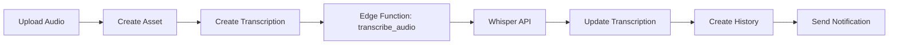
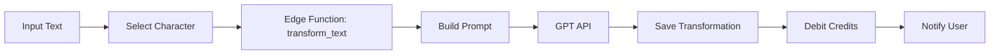

# Arcanum AI - Database Schema Documentation

**Version:** PRD v3  
**Last Updated:** 2025-11-13  
**Database:** PostgreSQL 17.x via Lovable Cloud  

---

## 📊 Entity Relationship Diagram (Text)

```
┌──────────────┐
│  auth.users  │ (Managed by Supabase Auth)
└──────┬───────┘
       │ 1:1
       ↓
┌──────────────┐      1:N     ┌──────────────┐
│   profiles   │──────────────→│   projects   │
└──────┬───────┘               └──────┬───────┘
       │                              │
       │ 1:N                          │ 1:N
       ↓                              ↓
┌──────────────┐               ┌──────────────┐
│  characters  │               │    assets    │
└──────────────┘               └──────┬───────┘
       │                              │
       │                              │ 1:N
       │                              ↓
       │                       ┌────────────────┐
       │                       │ transcriptions │
       │                       └────────────────┘
       │
       │ 1:N                   
       ↓                       
┌─────────────────────┐        ┌──────────────────┐
│ transformations     │        │ transcription_   │
└─────────────────────┘        │ history          │
                               └──────────────────┘

┌──────────────────┐    ┌──────────────────────┐
│     credits      │←─1:1│ credit_transactions  │
└──────────────────┘    └──────────────────────┘

┌──────────────────┐    ┌──────────────────┐
│ brand_profiles   │←─1:N│ brand_samples    │
└──────────────────┘    └──────────────────┘

┌─────────────────────┐  ┌───────────────────┐
│ protection_settings │  │  notifications    │
└─────────────────────┘  └───────────────────┘
```

---

## 🗄️ Tables Overview

### Core Tables

| Table | Purpose | Key Fields |
|-------|---------|------------|
| `profiles` | User profiles extending auth.users | id, full_name, brand_voice, preferences |
| `projects` | User projects for organizing content | id, user_id, name, description |
| `assets` | Uploaded files (audio/video/text) | id, project_id, storage_path, type, status |
| `transcriptions` | Transcription jobs (Whisper) | id, asset_id, status, text, error |
| `characters` | Brand voice personas (8 dimensions) | id, user_id, name, personality dimensions |
| `transformations` | Text transformation jobs (GPT) | id, type, input_text, output_text, cost_credits |

### Supporting Tables

| Table | Purpose | Key Fields |
|-------|---------|------------|
| `transcription_history` | Audit log of all transcriptions | id, user_id, original_text, transformed_text |
| `credits` | User credit balance (cache) | user_id, balance, is_unlimited |
| `credit_transactions` | Immutable credit ledger | id, user_id, amount, balance_after, reason |
| `notifications` | User notifications | id, user_id, type, title, message, read |
| `protection_settings` | Content moderation settings | id, user_id, auto_moderation, offensive_filter |
| `brand_profiles` | Brand voice training profiles | id, user_id, name, training_status |
| `brand_samples` | Training samples for brand voice | id, brand_profile_id, content |

---

## 📐 Schema Details

### 1. profiles

Extends `auth.users` with additional user data.

```sql
CREATE TABLE public.profiles (
  id UUID PRIMARY KEY REFERENCES auth.users(id) ON DELETE CASCADE,
  full_name TEXT,
  avatar_url TEXT,
  brand_voice JSONB DEFAULT '{}'::jsonb,
  preferences JSONB DEFAULT '{}'::jsonb,
  created_at TIMESTAMPTZ NOT NULL DEFAULT now(),
  updated_at TIMESTAMPTZ NOT NULL DEFAULT now()
);
```

**Indexes:**
- `idx_profiles_created_at` on `created_at`

**RLS Policies:**
- SELECT: Users can view own profile (`auth.uid() = id`)
- UPDATE: Users can update own profile

---

### 2. projects

User projects for organizing assets and transformations.

```sql
CREATE TABLE public.projects (
  id UUID PRIMARY KEY DEFAULT uuid_generate_v4(),
  user_id UUID NOT NULL REFERENCES public.profiles(id) ON DELETE CASCADE,
  name TEXT NOT NULL CHECK (length(name) >= 1 AND length(name) <= 200),
  description TEXT CHECK (length(description) <= 1000),
  metadata JSONB DEFAULT '{}'::jsonb,
  created_at TIMESTAMPTZ NOT NULL DEFAULT now(),
  updated_at TIMESTAMPTZ NOT NULL DEFAULT now()
);
```

**Indexes:**
- `idx_projects_user_id` on `user_id`
- `idx_projects_created_at` on `created_at DESC`

**RLS Policies:**
- SELECT/INSERT/UPDATE/DELETE: Owner-only (`auth.uid() = user_id`)

---

### 3. assets

Uploaded files with metadata and status tracking.

```sql
CREATE TABLE public.assets (
  id UUID PRIMARY KEY DEFAULT uuid_generate_v4(),
  project_id UUID REFERENCES public.projects(id) ON DELETE SET NULL,
  user_id UUID NOT NULL REFERENCES public.profiles(id) ON DELETE CASCADE,
  storage_path TEXT NOT NULL,
  type asset_type NOT NULL, -- ENUM: 'audio', 'video', 'text'
  status asset_status NOT NULL DEFAULT 'uploading', -- ENUM
  size_bytes BIGINT NOT NULL CHECK (size_bytes >= 0),
  duration_seconds NUMERIC(10,2) CHECK (duration_seconds >= 0),
  mimetype TEXT NOT NULL,
  metadata JSONB DEFAULT '{}'::jsonb,
  created_at TIMESTAMPTZ NOT NULL DEFAULT now(),
  updated_at TIMESTAMPTZ NOT NULL DEFAULT now()
);
```

**Indexes:**
- `idx_assets_user_id` on `user_id`
- `idx_assets_project_id` on `project_id`
- `idx_assets_status` on `status`
- `idx_assets_type` on `type`
- `idx_assets_created_at` on `created_at DESC`

**RLS Policies:**
- SELECT/INSERT/UPDATE/DELETE: Owner-only

**Storage Buckets:**
- `audio-files`: 50MB limit, audio mimetypes
- `video-files`: 500MB limit, video mimetypes
- `text-files`: 10MB limit, text/document mimetypes

---

### 4. transcriptions

Audio/video transcription jobs using Whisper API.

```sql
CREATE TABLE public.transcriptions (
  id UUID PRIMARY KEY DEFAULT uuid_generate_v4(),
  asset_id UUID NOT NULL REFERENCES public.assets(id) ON DELETE CASCADE,
  user_id UUID NOT NULL REFERENCES public.profiles(id) ON DELETE CASCADE,
  job_id TEXT,
  status job_status NOT NULL DEFAULT 'queued', -- ENUM
  language TEXT DEFAULT 'pt',
  text TEXT,
  error TEXT,
  metadata JSONB DEFAULT '{}'::jsonb,
  created_at TIMESTAMPTZ NOT NULL DEFAULT now(),
  updated_at TIMESTAMPTZ NOT NULL DEFAULT now()
);
```

**Status Flow:**
```
queued → processing → completed
                    ↘ failed
```

**Indexes:**
- `idx_transcriptions_asset_id` on `asset_id`
- `idx_transcriptions_user_id` on `user_id`
- `idx_transcriptions_status` on `status`
- `idx_transcriptions_created_at` on `created_at DESC`

**RLS Policies:**
- SELECT/INSERT/UPDATE/DELETE: Owner-only

---

### 5. characters

Brand voice personas with 8-dimensional personality model.

```sql
CREATE TABLE public.characters (
  id UUID PRIMARY KEY DEFAULT uuid_generate_v4(),
  user_id UUID NOT NULL REFERENCES public.profiles(id) ON DELETE CASCADE,
  name TEXT NOT NULL CHECK (length(name) >= 1 AND length(name) <= 100),
  description TEXT CHECK (length(description) <= 500),
  is_default BOOLEAN NOT NULL DEFAULT false,
  
  -- Personality dimensions (0-100 scale)
  formality INTEGER NOT NULL DEFAULT 50 CHECK (formality >= 0 AND formality <= 100),
  creativity INTEGER NOT NULL DEFAULT 50,
  enthusiasm INTEGER NOT NULL DEFAULT 50,
  empathy INTEGER NOT NULL DEFAULT 50,
  assertiveness INTEGER NOT NULL DEFAULT 50,
  humor INTEGER NOT NULL DEFAULT 50,
  detail_level INTEGER NOT NULL DEFAULT 50,
  technicality INTEGER NOT NULL DEFAULT 50,
  
  refinement_rules JSONB NOT NULL DEFAULT '[]'::jsonb,
  metadata JSONB DEFAULT '{}'::jsonb,
  created_at TIMESTAMPTZ NOT NULL DEFAULT now(),
  updated_at TIMESTAMPTZ NOT NULL DEFAULT now()
);
```

**Personality Dimensions:**
1. **Formality** (0-100): Casual ↔ Professional
2. **Creativity** (0-100): Conservative ↔ Innovative
3. **Enthusiasm** (0-100): Reserved ↔ Energetic
4. **Empathy** (0-100): Objective ↔ Compassionate
5. **Assertiveness** (0-100): Gentle ↔ Direct
6. **Humor** (0-100): Serious ↔ Playful
7. **Detail Level** (0-100): Concise ↔ Detailed
8. **Technicality** (0-100): Simple ↔ Technical

**Unique Index:**
- Only one default character per user: `idx_characters_one_default_per_user` on `(user_id, is_default) WHERE is_default = true`

**RLS Policies:**
- SELECT/INSERT/UPDATE/DELETE: Owner-only

---

### 6. transformations

Text transformation jobs using GPT with centralized prompt engine.

```sql
CREATE TABLE public.transformations (
  id UUID PRIMARY KEY DEFAULT uuid_generate_v4(),
  project_id UUID REFERENCES public.projects(id) ON DELETE SET NULL,
  user_id UUID NOT NULL REFERENCES public.profiles(id) ON DELETE CASCADE,
  source_asset_id UUID REFERENCES public.assets(id) ON DELETE SET NULL,
  type transformation_type NOT NULL, -- ENUM
  tone transformation_tone,          -- ENUM
  length transformation_length,      -- ENUM
  character_id UUID REFERENCES public.characters(id) ON DELETE SET NULL,
  input_text TEXT NOT NULL,
  output_text TEXT,
  variants JSONB DEFAULT '[]'::jsonb,
  status job_status NOT NULL DEFAULT 'queued',
  error TEXT,
  cost_credits INTEGER DEFAULT 0 CHECK (cost_credits >= 0),
  metadata JSONB DEFAULT '{}'::jsonb,
  created_at TIMESTAMPTZ NOT NULL DEFAULT now(),
  updated_at TIMESTAMPTZ NOT NULL DEFAULT now()
);
```

**Transformation Types:**
- `post` - Social media post
- `summary` - Content summarization
- `newsletter` - Newsletter format
- `script` - Video/audio script
- `custom` - Custom transformation

**RLS Policies:**
- SELECT/INSERT/UPDATE/DELETE: Owner-only

---

### 7. transcription_history

Historical audit log of all transcriptions and transformations.

```sql
CREATE TABLE public.transcription_history (
  id UUID PRIMARY KEY DEFAULT uuid_generate_v4(),
  user_id UUID NOT NULL REFERENCES public.profiles(id) ON DELETE CASCADE,
  project_id UUID REFERENCES public.projects(id) ON DELETE SET NULL,
  transcription_id UUID REFERENCES public.transcriptions(id) ON DELETE CASCADE,
  source_type source_type NOT NULL, -- ENUM: 'audio', 'video', 'text'
  source_asset_id UUID REFERENCES public.assets(id) ON DELETE SET NULL,
  original_text TEXT NOT NULL,
  transformed_text TEXT,
  character_id UUID REFERENCES public.characters(id) ON DELETE SET NULL,
  transformation_type transformation_type,
  transformation_length transformation_length,
  cost_dracmas INTEGER DEFAULT 0 CHECK (cost_dracmas >= 0),
  metadata JSONB DEFAULT '{}'::jsonb,
  created_at TIMESTAMPTZ NOT NULL DEFAULT now()
);
```

**RLS Policies:**
- SELECT/INSERT: Owner-only (no UPDATE/DELETE - immutable history)

---

### 8. credits & credit_transactions

Dual-table ledger system for credits. See [ADR 003](../adr/003-credit-ledger-system.md).

```sql
-- Credits balance (cache)
CREATE TABLE public.credits (
  user_id UUID PRIMARY KEY REFERENCES public.profiles(id) ON DELETE CASCADE,
  balance INTEGER NOT NULL DEFAULT 0 CHECK (balance >= 0),
  is_unlimited BOOLEAN NOT NULL DEFAULT false,
  updated_at TIMESTAMPTZ NOT NULL DEFAULT now()
);

-- Credits ledger (source of truth)
CREATE TABLE public.credit_transactions (
  id UUID PRIMARY KEY DEFAULT uuid_generate_v4(),
  user_id UUID NOT NULL REFERENCES public.profiles(id) ON DELETE CASCADE,
  amount INTEGER NOT NULL,
  balance_after INTEGER NOT NULL CHECK (balance_after >= 0),
  reason TEXT NOT NULL,
  ref_type TEXT,
  ref_id UUID,
  metadata JSONB DEFAULT '{}'::jsonb,
  created_at TIMESTAMPTZ NOT NULL DEFAULT now(),
  
  CONSTRAINT unique_transaction UNIQUE (user_id, ref_type, ref_id)
);
```

**Credit Flow:**
1. Transaction inserted into `credit_transactions`
2. Unique constraint ensures idempotency
3. Balance updated in `credits` table

**RLS Policies:**
- Owner-only for both tables

---

### 9. notifications

User notifications for job completion, credits, etc.

```sql
CREATE TABLE public.notifications (
  id UUID PRIMARY KEY DEFAULT uuid_generate_v4(),
  user_id UUID NOT NULL REFERENCES public.profiles(id) ON DELETE CASCADE,
  type notification_type NOT NULL, -- ENUM
  title TEXT NOT NULL,
  message TEXT NOT NULL,
  data JSONB DEFAULT '{}'::jsonb,
  read BOOLEAN NOT NULL DEFAULT false,
  priority TEXT DEFAULT 'normal' CHECK (priority IN ('low', 'normal', 'high')),
  created_at TIMESTAMPTZ NOT NULL DEFAULT now()
);
```

**Notification Types:**
- `transcription_complete` - Transcription job completed
- `transcription_failed` - Transcription job failed
- `transformation_complete` - Transformation completed
- `transformation_failed` - Transformation failed
- `credits_low` - Credit balance low
- `credits_debited` - Credits deducted
- `welcome` - Welcome message

**RLS Policies:**
- SELECT/UPDATE/DELETE: Owner-only

---

### 10. protection_settings

Content protection and moderation settings per user.

```sql
CREATE TABLE public.protection_settings (
  id UUID PRIMARY KEY DEFAULT uuid_generate_v4(),
  user_id UUID NOT NULL REFERENCES public.profiles(id) ON DELETE CASCADE,
  auto_moderation BOOLEAN NOT NULL DEFAULT false,
  offensive_filter BOOLEAN NOT NULL DEFAULT false,
  brand_verification BOOLEAN NOT NULL DEFAULT false,
  metadata JSONB DEFAULT '{}'::jsonb,
  created_at TIMESTAMPTZ NOT NULL DEFAULT now(),
  updated_at TIMESTAMPTZ NOT NULL DEFAULT now(),
  
  CONSTRAINT one_setting_per_user UNIQUE (user_id)
);
```

**RLS Policies:**
- SELECT/INSERT/UPDATE: Owner-only

---

### 11. brand_profiles & brand_samples

Brand voice training system for consistent output.

```sql
CREATE TABLE public.brand_profiles (
  id UUID PRIMARY KEY DEFAULT uuid_generate_v4(),
  user_id UUID NOT NULL REFERENCES public.profiles(id) ON DELETE CASCADE,
  name TEXT NOT NULL CHECK (length(name) >= 1 AND length(name) <= 100),
  description TEXT CHECK (length(description) <= 500),
  is_default BOOLEAN NOT NULL DEFAULT false,
  model_provider TEXT DEFAULT 'openai' CHECK (model_provider IN ('openai', 'anthropic')),
  model_name TEXT,
  training_status TEXT DEFAULT 'not_trained',
  metadata JSONB DEFAULT '{}'::jsonb,
  created_at TIMESTAMPTZ NOT NULL DEFAULT now(),
  updated_at TIMESTAMPTZ NOT NULL DEFAULT now()
);

CREATE TABLE public.brand_samples (
  id UUID PRIMARY KEY DEFAULT uuid_generate_v4(),
  brand_profile_id UUID NOT NULL REFERENCES public.brand_profiles(id) ON DELETE CASCADE,
  user_id UUID NOT NULL REFERENCES public.profiles(id) ON DELETE CASCADE,
  content TEXT NOT NULL CHECK (length(content) >= 10),
  source_url TEXT,
  metadata JSONB DEFAULT '{}'::jsonb,
  created_at TIMESTAMPTZ NOT NULL DEFAULT now()
);
```

**Training Status:**
- `not_trained` - Profile created but not trained
- `training` - Training in progress
- `trained` - Ready for use
- `failed` - Training failed

**RLS Policies:**
- Owner-only for all operations

---

## 🔐 ENUMs

### asset_type
```sql
CREATE TYPE asset_type AS ENUM ('audio', 'video', 'text');
```

### asset_status
```sql
CREATE TYPE asset_status AS ENUM ('uploading', 'processing', 'ready', 'failed');
```

### job_status
```sql
CREATE TYPE job_status AS ENUM ('queued', 'processing', 'completed', 'failed');
```

### transformation_type
```sql
CREATE TYPE transformation_type AS ENUM ('post', 'summary', 'newsletter', 'script', 'custom');
```

### transformation_length
```sql
CREATE TYPE transformation_length AS ENUM ('short', 'medium', 'long');
```

### transformation_tone
```sql
CREATE TYPE transformation_tone AS ENUM ('professional', 'casual', 'friendly', 'formal', 'inspirational');
```

### notification_type
```sql
CREATE TYPE notification_type AS ENUM (
  'transcription_complete',
  'transcription_failed',
  'transformation_complete', 
  'transformation_failed',
  'credits_low',
  'credits_debited',
  'welcome'
);
```

### source_type
```sql
CREATE TYPE source_type AS ENUM ('audio', 'video', 'text');
```

---

## 🔒 Security Model

### Row Level Security (RLS)

All tables have RLS enabled with **owner-only** policies:

```sql
-- Pattern for all tables
CREATE POLICY "Users can view own [table]" 
  ON public.[table] FOR SELECT 
  USING (auth.uid() = user_id);

CREATE POLICY "Users can create own [table]" 
  ON public.[table] FOR INSERT 
  WITH CHECK (auth.uid() = user_id);

CREATE POLICY "Users can update own [table]" 
  ON public.[table] FOR UPDATE 
  USING (auth.uid() = user_id);

CREATE POLICY "Users can delete own [table]" 
  ON public.[table] FOR DELETE 
  USING (auth.uid() = user_id);
```

### Storage Buckets

Path structure: `{user_id}/{project_id}/{timestamp}-{filename}`

**RLS for Storage Objects:**
```sql
-- Example for audio-files bucket
CREATE POLICY "Users can view own audio files" 
  ON storage.objects FOR SELECT 
  USING (
    bucket_id = 'audio-files' 
    AND auth.uid()::text = (storage.foldername(name))[1]
  );
```

---

## ⚡ Triggers and Functions

### 1. update_updated_at_column()

Auto-updates `updated_at` timestamp on row changes.

```sql
CREATE OR REPLACE FUNCTION public.update_updated_at_column()
RETURNS TRIGGER
LANGUAGE plpgsql
SECURITY DEFINER
SET search_path = public
AS $$
BEGIN
  NEW.updated_at = now();
  RETURN NEW;
END;
$$;
```

**Applied to:**
- profiles, projects, assets, transcriptions, characters
- transformations, credits, protection_settings, brand_profiles

---

### 2. handle_new_user()

Initializes new user with profile, credits, and welcome notification.

```sql
CREATE OR REPLACE FUNCTION public.handle_new_user()
RETURNS TRIGGER
LANGUAGE plpgsql
SECURITY DEFINER
SET search_path = public
AS $$
BEGIN
  -- Create profile
  INSERT INTO public.profiles (id, full_name, avatar_url)
  VALUES (
    NEW.id,
    COALESCE(NEW.raw_user_meta_data->>'full_name', ''),
    COALESCE(NEW.raw_user_meta_data->>'avatar_url', '')
  );
  
  -- Initialize credits with 100 free credits
  INSERT INTO public.credits (user_id, balance)
  VALUES (NEW.id, 100);
  
  -- Record initial credit transaction
  INSERT INTO public.credit_transactions (user_id, amount, balance_after, reason, ref_type)
  VALUES (NEW.id, 100, 100, 'Welcome bonus - 100 free credits', 'signup');
  
  -- Create welcome notification
  INSERT INTO public.notifications (user_id, type, title, message, priority)
  VALUES (
    NEW.id,
    'welcome',
    'Bem-vindo ao Arcanum AI! ✨',
    'Você recebeu 100 créditos gratuitos para começar sua jornada de transmutação criativa.',
    'high'
  );
  
  RETURN NEW;
END;
$$;
```

**Trigger:**
```sql
CREATE TRIGGER on_auth_user_created
  AFTER INSERT ON auth.users
  FOR EACH ROW
  EXECUTE FUNCTION public.handle_new_user();
```

---

## 📝 Query Examples

### 1. Get User Profile with Credits
```sql
SELECT 
  p.*,
  c.balance as credit_balance,
  c.is_unlimited
FROM profiles p
LEFT JOIN credits c ON c.user_id = p.id
WHERE p.id = auth.uid();
```

### 2. List Projects with Asset Count
```sql
SELECT 
  pr.id,
  pr.name,
  pr.description,
  COUNT(a.id) as total_assets,
  MAX(a.created_at) as last_upload
FROM projects pr
LEFT JOIN assets a ON a.project_id = pr.id
WHERE pr.user_id = auth.uid()
GROUP BY pr.id, pr.name, pr.description
ORDER BY pr.created_at DESC;
```

### 3. Transcription Status with Asset Info
```sql
SELECT 
  t.id,
  t.status,
  t.text,
  t.error,
  a.type as asset_type,
  a.mimetype,
  a.duration_seconds,
  t.created_at,
  t.updated_at
FROM transcriptions t
JOIN assets a ON a.id = t.asset_id
WHERE t.user_id = auth.uid()
ORDER BY t.created_at DESC
LIMIT 20;
```

### 4. Credit Transaction History
```sql
SELECT 
  ct.id,
  ct.amount,
  ct.balance_after,
  ct.reason,
  ct.ref_type,
  ct.created_at
FROM credit_transactions ct
WHERE ct.user_id = auth.uid()
ORDER BY ct.created_at DESC
LIMIT 50;
```

### 5. Transformation with Character Details
```sql
SELECT 
  tr.id,
  tr.type,
  tr.input_text,
  tr.output_text,
  tr.status,
  tr.cost_credits,
  c.name as character_name,
  c.formality,
  c.creativity
FROM transformations tr
LEFT JOIN characters c ON c.id = tr.character_id
WHERE tr.user_id = auth.uid()
ORDER BY tr.created_at DESC;
```

### 6. Unread Notifications
```sql
SELECT 
  id,
  type,
  title,
  message,
  priority,
  created_at
FROM notifications
WHERE user_id = auth.uid()
  AND read = false
ORDER BY 
  CASE priority
    WHEN 'high' THEN 1
    WHEN 'normal' THEN 2
    WHEN 'low' THEN 3
  END,
  created_at DESC;
```

---

## 📊 Performance Indexes

All tables have optimized indexes for common query patterns:

### Common Patterns
- **User-scoped queries**: Index on `user_id`
- **Time-series data**: Index on `created_at DESC`
- **Status filtering**: Index on `status`
- **Foreign key joins**: Index on FK columns
- **Unique constraints**: Partial unique indexes for conditional uniqueness

### Query Optimization Tips

1. **Always filter by user_id first** (leverages RLS + index)
2. **Use LIMIT** for large result sets
3. **Leverage created_at indexes** for pagination
4. **Use status indexes** for filtering by job state

---

## 🔄 Common Workflows

### Audio Transcription Flow



**SQL Trace:**
```sql
-- 1. Upload creates asset
INSERT INTO assets (user_id, project_id, storage_path, type, status)
VALUES (...) RETURNING id;

-- 2. Create transcription job
INSERT INTO transcriptions (asset_id, user_id, status, language)
VALUES (...) RETURNING id;

-- 3. Edge function updates when complete
UPDATE transcriptions 
SET status = 'completed', text = '...'
WHERE id = $1;

-- 4. Create history record
INSERT INTO transcription_history (...)
VALUES (...);

-- 5. Send notification
INSERT INTO notifications (user_id, type, title, message)
VALUES (...);
```

---

### Text Transformation Flow



**SQL Trace:**
```sql
-- 1. Get character personality
SELECT * FROM characters WHERE id = $1 AND user_id = auth.uid();

-- 2. Create transformation job
INSERT INTO transformations (user_id, character_id, type, input_text, status)
VALUES (...) RETURNING id;

-- 3. Update with result
UPDATE transformations 
SET status = 'completed', output_text = '...', cost_credits = 10
WHERE id = $1;

-- 4. Debit credits
INSERT INTO credit_transactions (user_id, amount, reason, ref_type, ref_id)
VALUES (auth.uid(), -10, 'Text transformation', 'transformation', $1);

UPDATE credits SET balance = balance - 10 WHERE user_id = auth.uid();
```

---

## 🚀 Migration Guide

All migrations are in `supabase/migrations/` and run automatically via Lovable Cloud.

**Applied Migrations:**
1. `20251113_000000_initial_schema.sql` - Complete schema setup
2. `20251113_000001_security_fixes.sql` - Function security hardening

**To verify schema status:**
```sql
SELECT table_name 
FROM information_schema.tables 
WHERE table_schema = 'public' 
ORDER BY table_name;
```

**Expected tables:**
- assets
- brand_profiles
- brand_samples
- characters
- credit_transactions
- credits
- notifications
- profiles
- projects
- protection_settings
- transcription_history
- transcriptions
- transformations

---

## 📚 Related Documentation

- [ADR 003: Credit Ledger System](../adr/003-credit-ledger-system.md)
- [PRD - Arcanum AI (v3)](../excencial/PRD_—_Arcanum_AI-2.txt)
- [API Documentation](../api/API-DOCUMENTATION.md)

---

## 🧪 Testing Queries

### Verify RLS is Working
```sql
-- Should return only current user's data
SELECT COUNT(*) FROM assets WHERE user_id = auth.uid();
SELECT COUNT(*) FROM transcriptions WHERE user_id = auth.uid();
SELECT COUNT(*) FROM characters WHERE user_id = auth.uid();
```

### Check Credit System Integrity
```sql
-- Balance should match sum of transactions
SELECT 
  c.user_id,
  c.balance as cached_balance,
  SUM(ct.amount) as calculated_balance
FROM credits c
JOIN credit_transactions ct ON ct.user_id = c.user_id
WHERE c.user_id = auth.uid()
GROUP BY c.user_id, c.balance;
```

### Monitor Job Status Distribution
```sql
SELECT 
  status,
  COUNT(*) as total,
  AVG(EXTRACT(EPOCH FROM (updated_at - created_at))) as avg_duration_seconds
FROM transcriptions
WHERE user_id = auth.uid()
GROUP BY status;
```

---

**End of Schema Documentation**
